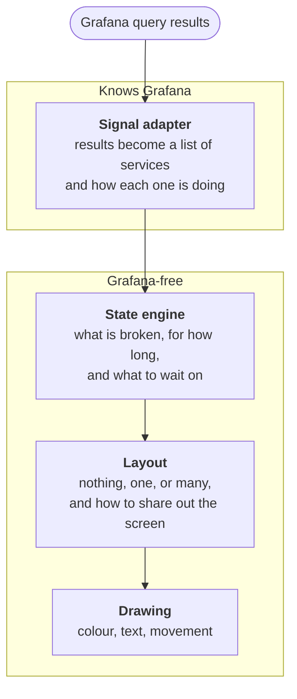

<div align="center">

<picture>
  <source media="(prefers-color-scheme: dark)" srcset="docs/brand/lockup-dark.svg">
  
</picture>

<h3>when nothing is wrong, it plays the DVD screensaver.<br>
when something is, the screen fills up with what broke.</h3>

<p><em>how bad is it right now? look up. you will know before you have read a word.</em></p>


</div>

A Grafana panel for the office television. It answers one question from across the room:

> **How bad are things right now?**

The screen gets noisier as more things break. Nothing healthy is ever drawn. All the space goes to whatever deserves attention right now.

```
NOTHING WRONG   →  quiet, a mark bouncing around the screen
ONE PROBLEM     →  it takes the whole screen
TWO PROBLEMS    →  the screen splits
MORE            →  the screen fills with boxes, biggest problem biggest
LASTING LONGER  →  its box grows and its colour strengthens
FIXED           →  the box goes and the others take the space
ALL FIXED       →  quiet again
```

## Try it

```bash
make setup
```

That installs everything, builds the plugin, and starts Grafana, a pretend estate of seven services, and Prometheus scraping it. Then:

| What | Where |
| --- | --- |
| The demo, the whole story on one panel | `make open` |
| The same panel on real Prometheus data, sized by error budget | `make real` |
| The same panel reading Sloth-shaped recording rules | `make sloth` |
| The four appear-and-disappear styles, side by side | `make motion` |
| Break services by hand | `make estate` |
| Fullscreen, no Grafana furniture | `make tv` |

The demo panel runs a shipping incident. Shipping starts missing its objective; checkout goes next because it cannot quote a delivery date, then the basket because it cannot show a total, then orders because they cannot be placed. Search, accounts and reviews never appear at all, because nothing is wrong with them. It takes two minutes and then everything is fixed.

The other dashboards read the same panel from real Prometheus data, one sized by error budget burned and one reading Sloth-shaped recording rules. All of them run the same code; only where the numbers come from differs.

There is no login. Run `make doctor` if something is not working.

## Using it on your own data

Give the panel an availability per service, where 1 is perfect and smaller is worse. Point it at the query, tell it which column or label holds the service name, and change nothing else.

Availability is good events over total events, the ordinary shape of an SLO and what most people already compute. Out of the box, below 99% is a warning and below 95% is critical.

Anything else you already have works too. Set the two levels in whatever units your query returns and say which way the number runs.

| What you have | Worse when | Warning | Critical |
| --- | --- | --- | --- |
| **Availability, ratio** | **Lower** | **0.99** | **0.95** |
| Error budget remaining, ratio | Lower | 0.5 | 0.1 |
| Error budget burned, percent | Higher | 50 | 90 |
| Burn rate | Higher | 6 | 14.4 |
| Plain status number | Higher | 1 | 2 |

The number matters, not just the threshold it crossed. A service at 90% availability gets visibly more screen than one at 94%.

**Sloth and Pyrra work as they are.** For Sloth, query `1 - slo:sli_error:ratio_rate1h`, set the name to `sloth_service`, and you are finished; the defaults do the rest. The demo in this repository publishes metrics under exactly those names so you can see it working before touching your own.

**One limit worth knowing before you wire it up.** The warning and critical levels apply to every service the query returns. If your services are held to different objectives, put each group on its own panel, or feed a number already normalised against each service's own objective. `docs/metrics.md` explains why, with worked numbers, and lists the few things only you can get right: units, direction, stable names and fresh data.

**[Full documentation, with example queries for Sloth, Pyrra and raw request counts, is in `docs/metrics.md`.](docs/metrics.md)**

The rest of the panel options:

| Setting | What it does |
| --- | --- |
| Name, Value | Which columns to read. Empty means guess. |
| Value to use | Last, worst, or average, when a service has several readings. |
| Worse when | Whether a bigger number means a worse problem. |
| Warning, Critical | The levels that count as a warning and as critical. |
| Quiet mode, Quiet mark | What to show when nothing is wrong. See below. |
| 3D text, size, depth, speed, material, colour | What the 3D screensaver spells out and how it looks. |
| Grow with age | Give a long-running problem more of the screen. |
| Transition | How long boxes take to move. |
| Appear and disappear | Grow, Flash, Fade or None. |
| Most boxes on screen | The ceiling on boxes. The rest share one saying how many more. |
| Demo | Run a built-in example instead of the query. |

### When nothing is wrong

An empty screen looks like a broken screen. So when everything is healthy the panel runs a screensaver, and you can tell at a glance that it is still working.

| Quiet mark | What it does |
| --- | --- |
| **DVD logo** | Drifts and bounces off the edges, changing colour on every wall it hits. The default. Someone will eventually see it hit a corner. |
| **Our logo** | The same bounce, calm, in the theme's colour. |
| **3D text** | The Windows XP *3D Text* screensaver with our lockup: extruded, tumbling forever on all three axes in a black void, lit like early-2000s OpenGL. It is only readable now and then, every couple of minutes, as the original was. |

`make quiet` opens the DVD logo fullscreen and `make spin` the 3D text.

The DVD logo is a trademark of DVD Format/Logo Licensing Corporation. noise is bad. is not affiliated with or endorsed by them; the logo is a credited nod to the screensaver, not a licensed use. The outline was traced from [bouncingdvdlogo.com](https://bouncingdvdlogo.com). Full credits, including the typeface and libraries the panel ships, are in [`THIRD_PARTY_NOTICES.md`](THIRD_PARTY_NOTICES.md).

A service that reads healthy stays on screen for two more checks before it goes, so a service flicking on and off does not make the screen flash. A service that disappears from the query entirely is kept, not cleared, because a metric going missing is not the same as a problem being fixed.

Alerts work too, but are not the default. `ALERTS` is always 1 with the severity in a label, so there is no number to size a box by, and it turns this into an alert list rather than a picture of how bad things are. `docs/metrics.md` covers the workaround.

## Developing

```bash
make dev      # rebuild on save, leave running
make check    # typecheck, lint, unit tests
make e2e      # browser tests against the running Grafana
make          # every target
```

Run `make restart` after changing `src/plugin.json`. Do not edit anything in `.config/`; it is generated by `npx @grafana/create-plugin update`.

## How it is put together

Four steps. Only the first knows Grafana exists, so the interesting parts could outlive the plugin.



`src/noise/`, `src/demo/` and `src/render/` may not import from Grafana, and a test fails if they ever do.

## Support

noise is bad. is free and stays free. Two ways to keep it going:

**If it is on your wall,** [buy me a coffee](https://buymeacoffee.com/triwats).

**If you sell to the people who stare at wallboards,** sponsor it. Observability, incident and on-call vendors get their name here, in front of exactly that audience.

[](https://github.com/sponsors/triwats)

## Licence

Apache-2.0.
